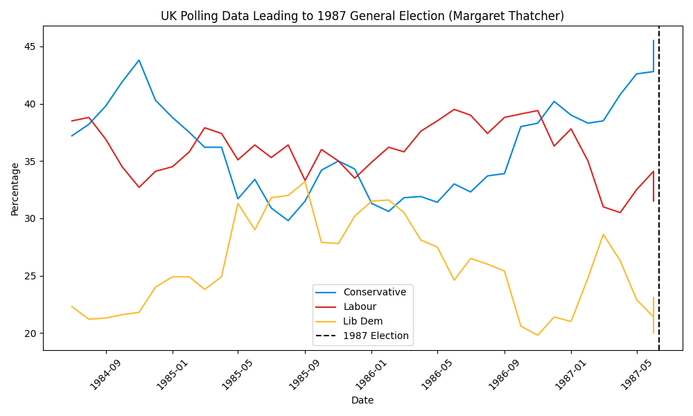
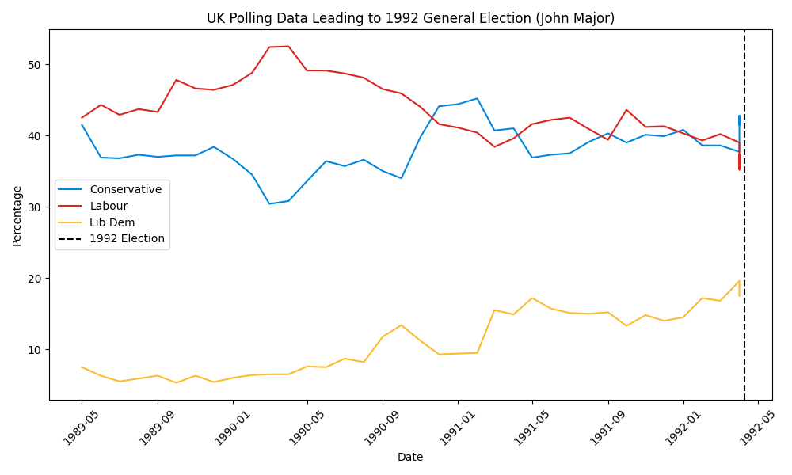
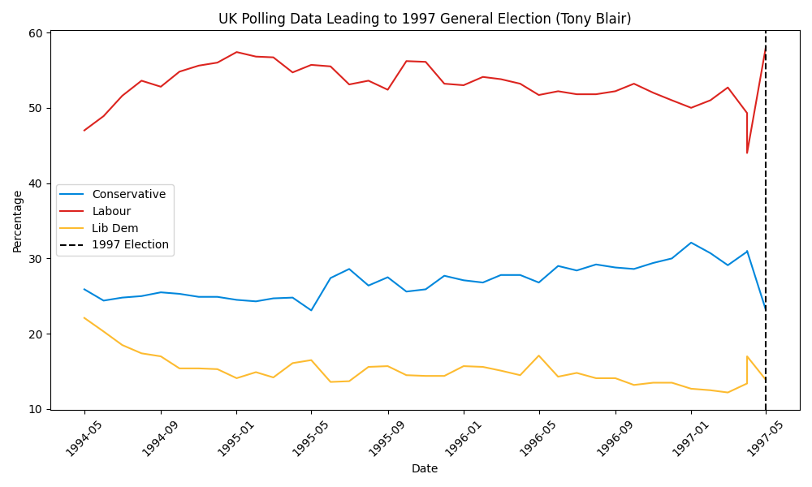
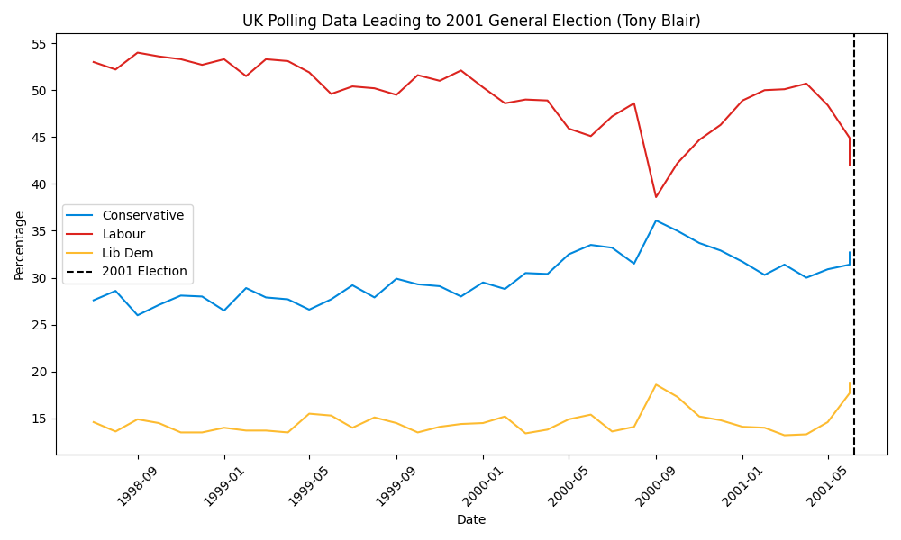
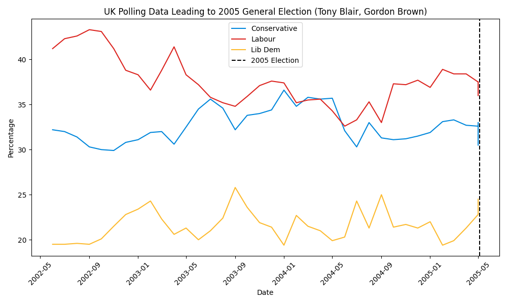
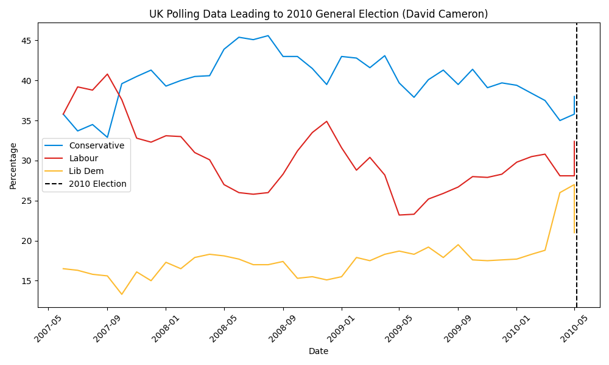
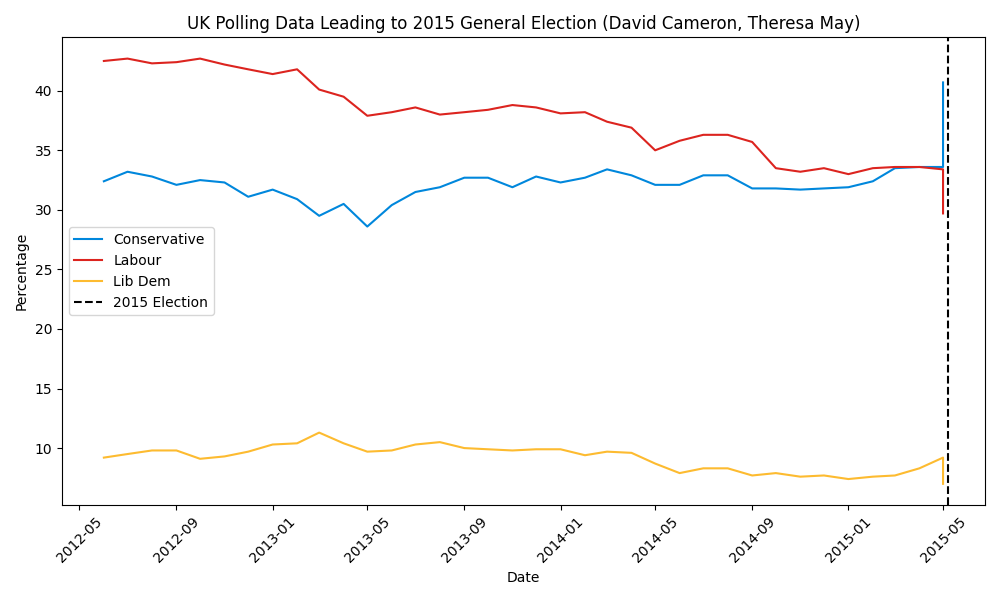
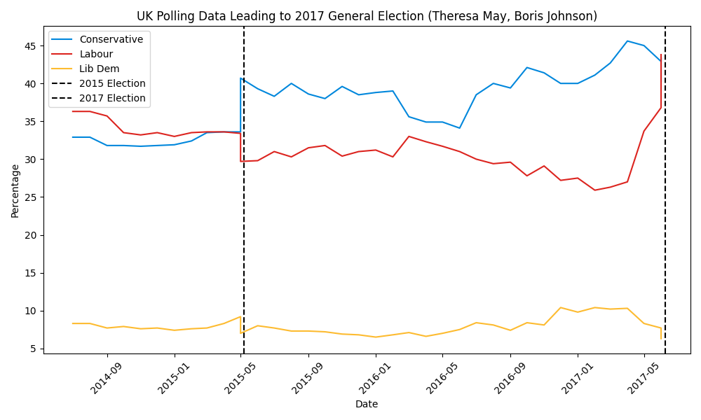
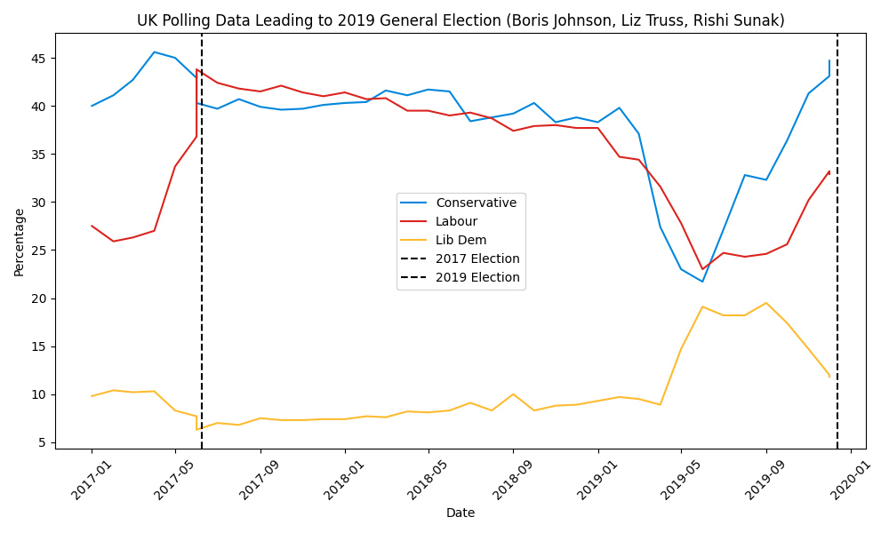

# UK Political Polling Data Analysis and Visualization

This repository contains scripts for processing, analyzing, and visualizing UK political polling data. The data spans multiple political parties and general elections, and the scripts generate both JSON data files and charts for the polling data leading up to each general election.

## Data Source

The polling data is sourced from Mark Pack's archive, available at [Mark Pack's website](https://www.markpack.org.uk/mark-pack-archives/).

## Dependencies

The project relies on several Python libraries for data processing and visualization. Make sure you have the following dependencies installed:

- pandas
- numpy
- matplotlib
- json

You can install these using pip:
```bash
pip install pandas numpy matplotlib json
```
## Files

The project includes the following key files:

- `main.py`: This script cleans the raw polling data by handling missing values, standardizing date formats, and restructuring the data. The cleaned data is saved in CSV format and JSON format for further processing.

- `plot.py`: This script reads the cleaned polling data and the general elections data. It creates a directory for storing JSON data and charts if they don't already exist. The script generates JSON files and visualizations for the polling data leading up to each general election, saved in their respective directories.

- `monthly_averages.csv`: This is the raw CSV file containing the monthly average polling data.

- `cleaned_uk_polling_data.csv`: This CSV file is generated by `main.py` and contains the cleaned polling data.

- `uk_polling_data.json`: This JSON file, created by `main.py`, contains the cleaned polling data in a format suitable for web applications.

- `elections.csv`: This CSV file contains data about the general elections.

## Usage

1. Ensure that you have the necessary Python libraries installed (see Dependencies section).

2. Clone the repository to your local machine:
    ```bash
    git clone https://github.com/your-username/uk-political-polling.git
    ```

3. Navigate to the directory containing the project files.

4. Run `main.py` to clean the raw polling data and generate the `cleaned_uk_polling_data.csv` and `uk_polling_data.json` files:
    ```bash
    python main.py
    ```

5. Run `plot.py` to generate the visualizations and JSON files for each general election:
    ```bash
    python plot.py
    ```

After executing the scripts, you'll find the charts in the `charts/` directory and the JSON files in the `json_files/` directory.

## Visualizations

Below are some of the charts generated by the script:











## Contributing

Contributions are welcome. Please feel free to open an issue or submit a pull request.

## License

This project is licensed under the MIT License. See the [LICENSE](LICENSE) file for details.

## Acknowledgments

Thanks to Mark Pack for providing the polling data.
